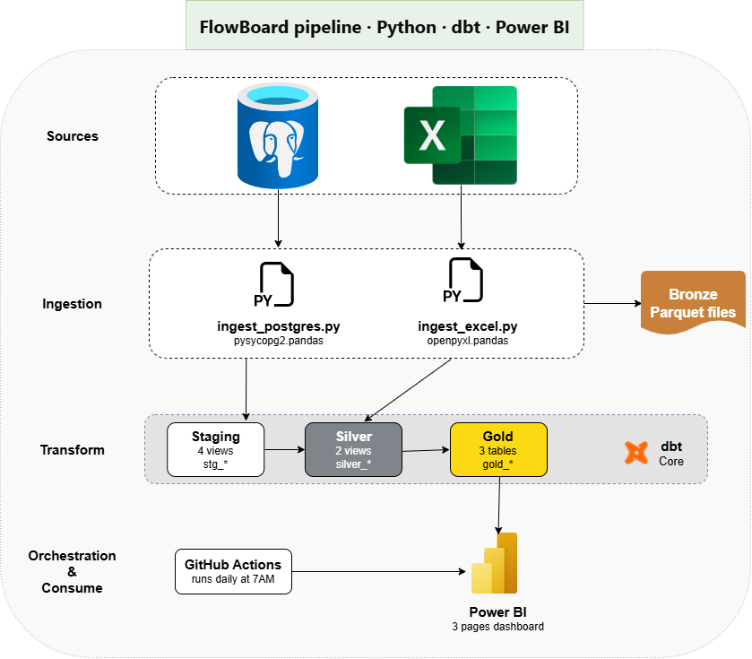

# FlowBoard — Automated Financial Dashboard

A full end-to-end BI pipeline built as a portfolio project demonstrating 
the **Automated Financial Reporting** for fintech and financial services companies.

## Business Problem

Finance teams at payment companies spend 2–3 days every month manually 
pulling transaction data into Excel, cleaning it, and building reports 
that are already outdated by the time leadership sees them. They have no 
real-time visibility into FX margin by corridor, client revenue trends, 
or early churn signals.

## Solution

A fully automated pipeline that ingests data from two sources daily, 
transforms it through a medallion architecture, and serves a live 
Power BI dashboard refreshed every morning — zero manual work.

## Architecture

PostgreSQL (transactions, clients)
Excel (revenue targets, FX fee schedule)
↓
Python ingestion scripts
↓
dbt transformation (Bronze → Silver → Gold)
↓
Power BI dashboard (3 pages)

## Tech Stack

| Layer | Tool |
|---|---|
| Source systems | PostgreSQL, Excel |
| Ingestion | Python (pandas, psycopg2, openpyxl) |
| Transformation | dbt Core |
| Data model | Star schema |
| Visualization | Power BI |

## Dashboard Pages

**Page 1 — Executive Overview**
Revenue vs target, MoM growth, 3-month trend, monthly status table

**Page 2 — Corridor Performance**
FX revenue by corridor, volume vs margin scatter, monthly margin heat map

**Page 3 — Client Intelligence**
Active/At Risk KPIs, revenue by segment, top client ranking, health signals

## dbt Models

**Staging (4 views)**
- stg_transactions
- stg_clients
- stg_revenue_targets
- stg_fx_fee_schedule

**Silver (2 views)**
- silver_transactions
- silver_monthly_summary

**Gold (3 tables)**
- gold_executive_summary
- gold_corridor_performance
- gold_client_performance

## Setup

**1. Install dependencies**

pip install psycopg2-binary pandas openpyxl sqlalchemy faker dbt-postgres

**2. Generate synthetic data**

python generate_data.py
python ingest_postgres.py
python generate_excel.py
python ingest_excel.py
python load_staging.py

**3. Run dbt pipeline**

cd flowboard_dbt
dbt run

**4. Open Power BI**

Open FlowBoard_Demo.pbix and refresh the data source.

If your finance team still spends days on manual reports,
connect with me on [LinkedIn](https://linkedin.com/in/eddymanouan).